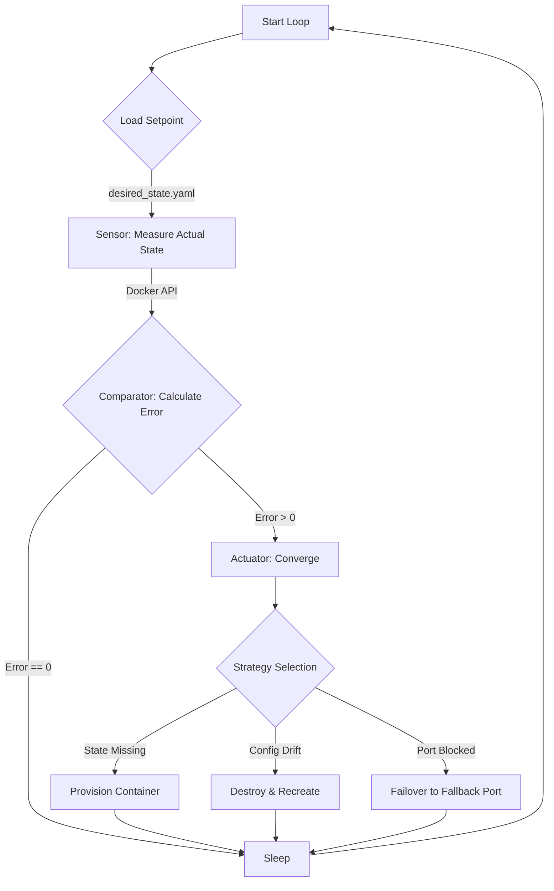

# Drift Control: Self-Healing Infrastructure Agent

> **"Infrastructure as Code defines the desired state. Control Theory enforces it."**

**Container Drift Control** is a Proof-of-Concept (POC) illustrating how **Cybernetics** and **Control Theory** principles form the backbone of modern reliability engineering.

It implements a continuous **Reconciliation Loop** (or Feedback Controller) that autonomously detects and corrects entropy (drift) in a system without human intervention. This is the fundamental pattern behind Kubernetes Controllers, Terraform, and other declarative systems.

## 🧠 The Philosophy: Cybernetics in DevOps

In traditional operations, infrastructure is "managed" via linear scripts. In **DevOps** engineering, infrastructure is "regulated" via closed-loop systems.

This agent treats a Docker container as a **Process Variable (PV)** that must be maintained at a specific **Setpoint (SP)** defined in `desired_state.yaml`.

### The Control Loop

The system operates on a continuous `Look -> Compare -> Converge` cycle:

1. **Sensor (Observer):** Measures the *Actual State* of the runtime (Is the container running? What port is it bound to? Is the image tag correct?).
2. **Comparator (Error Detector):** Calculates the **Error Signal** by diffing `Actual State` vs. `Desired State`.
3. **Actuator (Controller):** Applies a corrective force to eliminate the error (e.g., Restarting a process, switching ports).

If `Error == 0`, the system is in **Equilibrium**. If `Error > 0`, the system acts to restore stability.

## 🏗️ Architecture

The agent runs as a single-threaded daemon ensuring the state of a critical service (`nginx`). It features **Actuator Robustness** via a fallback mechanism: if the primary port is blocked by a rogue process, the agent automatically "heals" the service onto a backup port.



## 🚀 Getting Started

This project uses **Modern Python** tooling (`uv`, `ruff`, `mypy`) to ensure rigorous code quality.

### Prerequisites

* **Docker Daemon** (Running)
* **Python 3.12+**
* **Make** (for orchestration)

### Installation

1. **Clone and Setup:**
```bash
git clone https://github.com/danielfcollier/py-drift-control.git
cd drift-control
make setup
make install
```

## 🎮 The "Drift" Demo

To demonstrate the system's self-healing capabilities, it's used a **dual-terminal** setup.

### 1. Start the Controller

In **Terminal 1**, start the reconciliation daemon. It will provision the service immediately.

```bash
make start
```

*Output:* `✅ SYSTEM HEALED: State converged to Port 8080`

### 2. Inject Entropy (The Attack)

In **Terminal 2**, you can simulate various outages using the included **Chaos Monkey** or manual intervention.

#### Scenario A: Process Failure (Availability Drift)

The Chaos Monkey will randomly send `SIGKILL` signals or stop the container.

```bash
make attack
```

*Observation:* The daemon detects `Status deviation (Actual: exited != Desired: running)` and restarts the service within 5 seconds.

#### Scenario B: Resource Contention (Robustness)

Simulate a "Port Conflict" where a rogue process steals the primary port (8080).

```bash
make conflict
```

*Observation:*

1. The daemon attempts to bind Port 8080 and fails (`Address already in use`).
2. The **Smart Actuator** catches the exception and triggers the fallback logic.
3. `⚠️ Port 8080 busy. Attempting fallback to 8081...`
4. The system stabilizes on the backup port.

## 📂 Project Structure

A modular Python structure separating the domain model from the control logic.

```text
drift-control/
├── Makefile              # Orchestration & Quality Checks
├── pyproject.toml        # Dependency Management (uv/Ruff)
├── desired_state.yaml    # The Setpoint (Configuration)
└── src/
    ├── chaos_monkey.py   # Fault Injection Tool
    └── drift_control/
        ├── main.py       # The Control Loop (Daemon)
        ├── models.py     # Pydantic Schema (Validation)
        └── reconciler.py # Sensor, Comparator, & Actuator Logic
        └── settings.py   # App Settings 
```

## 🧪 Engineering Standards

This project adheres to strict DevOps quality standards:

* **Type Safety:** 100% Typed Python (checked via `mypy`).
* **Linting:** Compliant with `ruff` strict rules.
* **Immutable Infrastructure:** Drift is resolved by *replacement* (Destroy/Create), not *mutation* (Patching in place).
